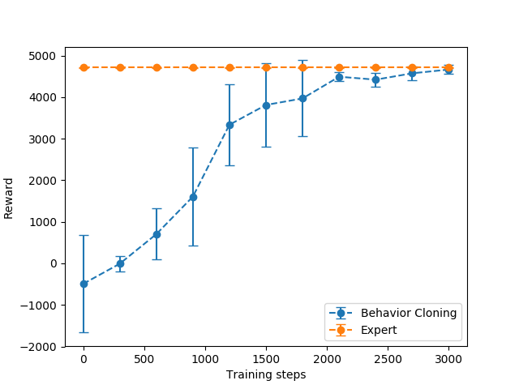
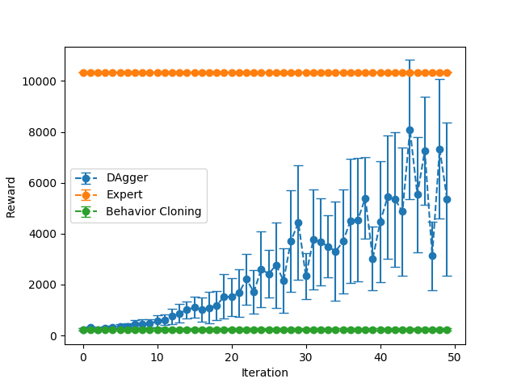

# Behavioral Cloning

To run Ant:
```bash
python cs285/scripts/run_hw1_behavior_cloning.py --expert_policy_file cs285/policies/experts/Ant.pkl --env_name Ant-v2 --exp_name test_bc_ant --n_iter 1 --expert_data cs285/expert_data/expert_data_Ant-v2.pkl --eval_batch_size 10000 --video_log_freq -1
```
To run Humanoid:
```bash
python cs285/scripts/run_hw1_behavior_cloning.py --expert_policy_file cs285/policies/experts/Humanoid.pkl --env_name Humanoid-v2 --exp_name test_bc_humanoid --n_iter 1 --expert_data cs285/expert_data/expert_data_Humanoid-v2.pkl --eval_batch_size 10000 --video_log_freq -1
```

The following table comapres Behavioral Cloning with Expert policy in Ant and Humanoid environment. We see that Behavioral Cloning achieves more than 50% of expert reward during evaluation in Ant but less than 3% in Humanoi
|                |   Expert Mean   | Expert Std |   BC Mean   | BC Std |
| :------------: | :-----: | :------: | :-----: | :------: |
|  Ant   | 4713.65 | 12.20 | 2419.26 | 1035.21 |
| Humanoid | 10344.52 |  20.98  | 271.48 | 68.47 |

*Table 1: Behavioral Cloning vs Expert with eval_batch_size = 10000*

To run various with training steps:
```bash
for num_steps in {0..3000..300}; do
	python cs285/scripts/run_hw1_behavior_cloning.py --expert_policy_file cs285/policies/experts/Ant.pkl --env_name Ant-v2 --exp_name test_bc_ant --n_iter 1 --expert_data cs285/expert_data/expert_data_Ant-v2.pkl --num_agent_train_steps_per_iter ${num_steps} --eval_batch_size 10000 --video_log_freq -1;
done;
```

*Fig 1: Increasing training steps from 0 to 3000 leads to higher reward*

# Dagger
To run Dagger
```bash
python cs285/scripts/run_hw1_behavior_cloning.py --expert_policy_file cs285/policies/experts/Humanoid.pkl --env_name Humanoid-v2 --exp_name test_bc_humanoid --n_iter 50 --do_dagger --expert_data cs285/expert_data/expert_data_Humanoid-v2.pkl --num_agent_train_steps_per_iter 5000 --eval_batch_size 5000 --video_log_freq -1 --use_gpu
```

*Fig 2: training steps = 5000, eval_batch_size 5000*

We observe significant improvement in reward when using Dagger over naive Behavioral Cloning.

