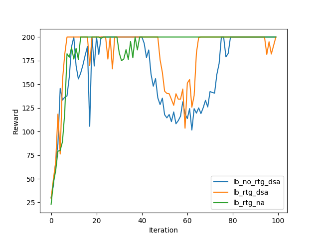
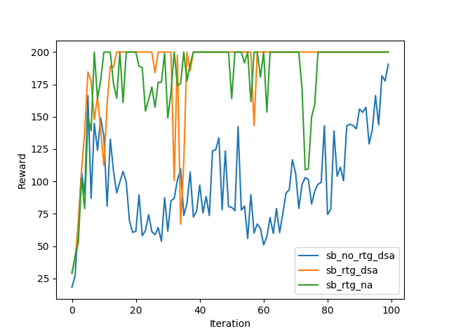
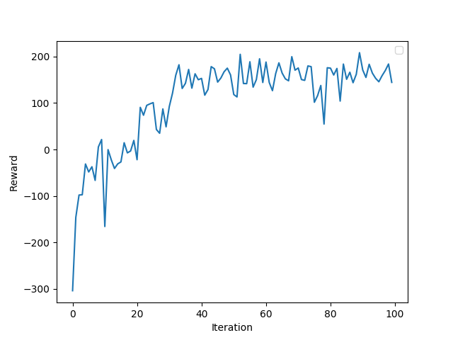
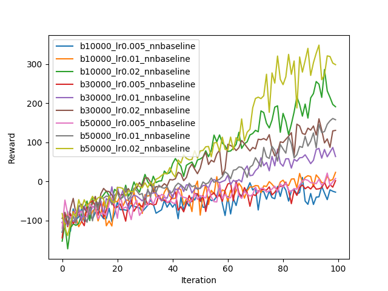
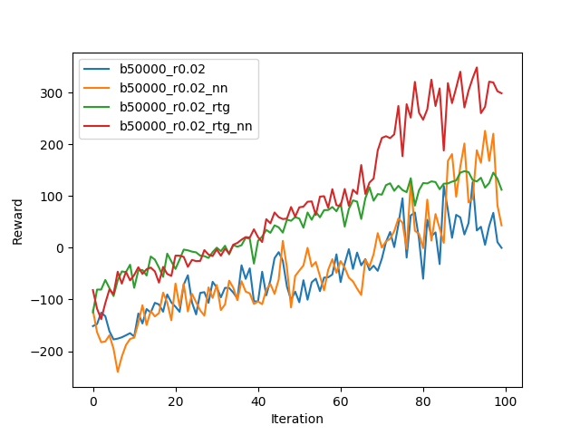

### CartPole
To run with various settings
```bash
python run_hw2_policy_gradient.py --env_name CartPole-v0 -n 100 -b 1000 -dsa --exp_name sb_no_rtg_dsa
python run_hw2_policy_gradient.py --env_name CartPole-v0 -n 100 -b 1000 -rtg -dsa --exp_name sb_rtg_dsa
python run_hw2_policy_gradient.py --env_name CartPole-v0 -n 100 -b 1000 -rtg --exp_name sb_rtg_na
python run_hw2_policy_gradient.py --env_name CartPole-v0 -n 100 -b 5000 -dsa --exp_name lb_no_rtg_dsa
python run_hw2_policy_gradient.py --env_name CartPole-v0 -n 100 -b 5000 -rtg -dsa --exp_name lb_rtg_dsa
python run_hw2_policy_gradient.py --env_name CartPole-v0 -n 100 -b 5000 -rtg --exp_name lb_rtg_na
```

*Fig 1: small batch sizes*


*Fig 2: large batch sizes*
We see that using 
1. reward-to-goleads to better performance especially for small batch sizes.
2. Advantage standardization helps.
3. Larger bacth size helps.

### InvertedPendulum
To run InvertedPendulum:
```bash
python run_hw2_policy_gradient.py --env_name InvertedPendulum-v2 --ep_len 1000 --discount 0.9 -n 100 -l 2 -s 64 -b 500 -lr 1e-2 -rtg --exp_name inverted_pendulum
```

*Fig 3: batch size = 500, learning rate = 0.01*

### LunarLander
To run LunarLander:
```bash
python run_hw2_policy_gradient.py --env_name LunarLanderContinuous-v2 --ep_len 1000 --discount 0.99 -n 100 -l 2 -s 64 -b 40000 -lr 0.005 -rtg --nn_baseline --exp_name ll_b40000_r0.005 --use_gpu
```

*Fig 4: LunarLander with neural networks baseline*

###HalfCheetah

*Fig 5: HalfCheetah with neural networks baseline*
Within the attempted parameters, both increasing batch size and learning rate improves the learning.


*Fig 6: More HalfCheetah*
Using reward-to-go or nearual network baseline does indeed significantly improve performance.
